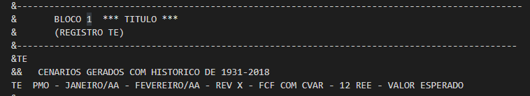
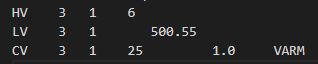

Tutorial
=========

Este guia pode ser um bom ponto inicial para o uso do *idecomp*. Como interface de desenvolvimento é recomendado
usar algum editor com um `language server` com um recurso de sugestões automáticas eficiente para Python, como o
`VSCode <https://code.visualstudio.com/>`_ com `PyLance <https://marketplace.visualstudio.com/items?itemName=ms-python.vscode-pylance>`_
ou a IDE específica `PyCharm <https://www.jetbrains.com/pt-br/pycharm/download/>`_. As sugestões automáticas são essenciais para fazer uso de todo o potencial do
módulo *idecomp*, além de auxiliar na escrita de códigos melhores.

Leitura e escrita do dadger.rvX
-------------------------------

Seja um sistema de arquivos no qual, dentro de um diretório cujo caminho é::

    $ pwd
    $ /home/usuario/estudo/dcp_AAAA_MM_rvX/

E neste diretório exista um arquivo ``dadger.rvX``, então o conteúdo deste pode ser lido 
através do código::

    >>> from inewave.decomp.dadger import Dadger
    >>> dadger = Dadger.le_arquivo("/home/usuario/estudo/dcp_AAAA_MM_rvX/", "dadger.rvX")

.. currentmodule:: idecomp.decomp.dadger

É possível ter acesso a diversos registros existentes no dadger::

    >>> dadger.te.titulo
    'PMO - JANEIRO/AA - FEVEREIRO/AA - REV X - FCF COM CVAR - 12 REE - VALOR ESP'
    >>> dadger.ti(1).taxas
    [0.2, 0.2, 0.2, 0.2, 0.2, 0.2]
    >>> dadger.lv(3, 1).limite_inferior 
    623.0

Ao comparar com as informações existentes no arquivo `dadger.rvX`:

.. image:: figures/registro_ti_dadger.png
  :width: 480

.. image:: figures/registro_lv_dadger.png
  :width: 480

Como o dadger é um arquivo de entrada do DECOMP, cada um dos registro é editável (em desenvolvimento). Além disso,
ao final é possível realizar a escrita do arquivo para geração automatizada de estudos.

Por exemplo, ao alterar o limite do registro LV mostrado acima e realizar a escrita do arquivo com::

    >>> dadger.lv(3, 1).limite_inferior = 500.55 
    >>> dadger.escreve_arquivo("/home/usuario/estudo/dcp_AAAA_MM_rvX/", "dadger.rvX")

Temos o arquivo atualizado com o conteúdo da linha:

Mais informações estão disponíveis na referência do objeto `Dadger`.

Leitura do relato.rvX
----------------------

Seja um sistema de arquivos no qual, dentro de um diretório cujo caminho é::

    $ pwd
    $ /home/usuario/estudo/dcp_AAAA_MM_rvX/

E neste diretório exista um arquivo ``relato.rvX``, então o conteúdo deste pode ser lido 
através do código::

    >>> from inewave.decomp.relato import Relato
    >>> rel = Relato.le_arquivo("/home/usuario/estudo/dcp_AAAA_MM_rvX/", "relato.rvX")

.. currentmodule:: idecomp.decomp.relato

É possível ter acesso a diversos blocos de informação existentes no relato::

    >>> rel.energia_armazenada_maxima_subsistema
      Subsistema    Earmax
    0         SE  204321.7
    1          S   19897.2
    2         NE   51605.5
    3          N   15212.9
    >>> rel.energia_armazenada_subsistema
      Subsistema  Inicial  Estágio 1  Estágio 2  Estágio 3  Estágio 4  Estágio 5
    0         SE     20.4       20.7       21.1       21.9       23.3       25.2
    1          S     30.6       29.9       28.9       28.4       29.2       31.2
    2         NE     37.6       37.6       37.4       37.5       37.9       39.0
    3          N     15.0       15.8       16.7       17.8       19.0       21.4

Se comparado com o conteúdo do arquivo `relato.rvX`:

.. image:: figures/earm_subsis_relato.png
  :width: 480

Para mais informações, basta consultar a referência do objeto `Relato`.
